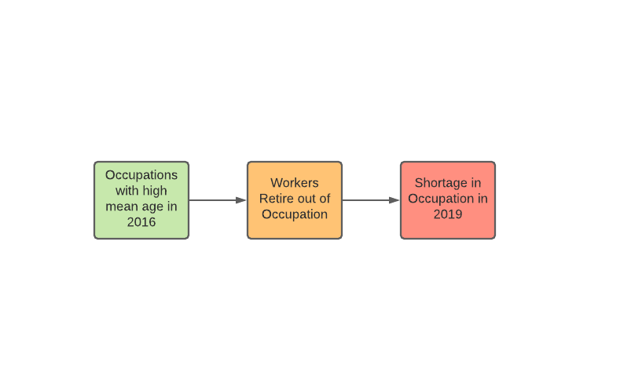
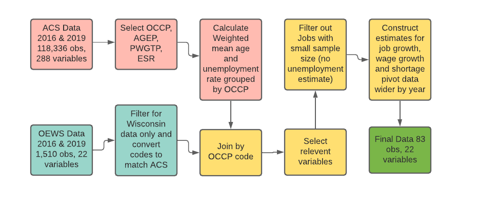
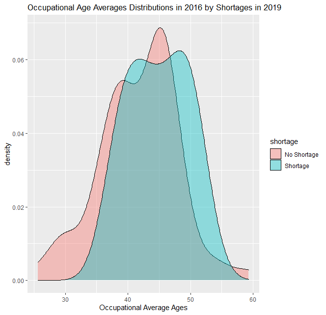
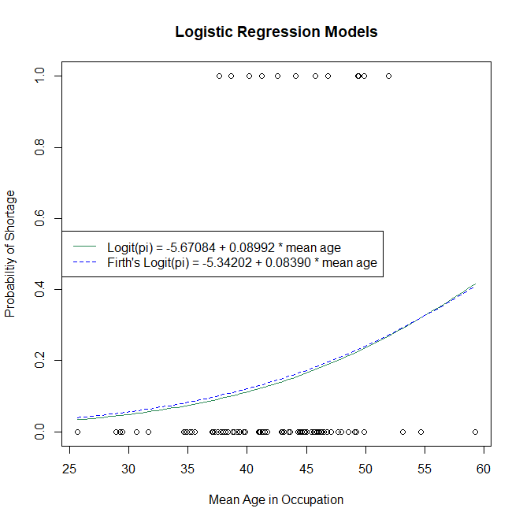

```{r setup, include=FALSE}
library(formatR)
knitr::opts_chunk$set(echo = TRUE, tidy=TRUE, tidy.opts=list(width.cutoff=60), comment = NA, warning = FALSE, message = FALSE)
```

## Introduction

The aim of this project is to analyze the relationship between age in occupational sectors and labor shortages within occupational sectors in Wisconsin. Furthermore we wish to test how well labor shortages can be predicted using ages within said occupational sectors. The motivation behind exploring this relationship is that there is a commonly held idea that jobs which are held mostly by older workers are more prone to shortages. For instance, the average age of farm workers in Wisconsin is 53, which is considerably greater than the average age of all workers in Wisconsin. Additionally there is a shortage of farm workers in Wisconsin. It would not be illogical to assume that there is a connection between these two facts. In this report we will explore this question. We will examine ages within occupations in 2016 and examine shortages within those same occupations in 2019. This relationship is visualized in figure 1. 



### Thesis Statments

In this paper we argue that the average age within occupational sectors in Wisconsin has no significant bearing on the probability of labor shortage in that occupational sector. And furthermore there is no significant relationship between average age within occupational sectors and shortages in occupations in Wisconsin. 

## Data

The code relating to this section can be found in appendix **[Section 1](#Section1)**.

The data for this project come from two primary sources. The first is American Community Survey (ACS) Person data for Wisconsin. And the second is the Occupational Employment and Wage Statistics (OEWS) state data for Wisconsin also. (Add reference for link) The data in its raw form required a lot of reprocessing. The ACS data for 2016 and 2019 together was 118,336 observations with 288 variables. The vast majority of these variables were not useful to answering our research question. Consequently only the following variables were selected from the ACS data: OCCP (Occupational Code), AGEP (Age of the Person), PWGTP (Replicate Weight Estimate) and ESR (Employment Status). This subset of data was then grouped by year and occupation code, so that a weighted estimate could be constructed of the mean age within occupations and unemployment rate within occupations. The result was data set with 4 variables and 996 observations representing approximately 498 occupations across two years (2016 and 2019). 

This grouped data frame was joined to the OEWS data for Wisconsin for 2016 and 2019 by occupation code. Because there are fewer ACS occupational codes than there are OWES occupational codes, this means that ACS codes tend to be broader and represent more occupations that OWES code. Using a crosswalk key between these two code systems it was determined which codes mapped to each other. In instances where there was multiple OEWS codes for one ACS code, the OEWS observations were merged into one observation. Additionally there were occupations were the sample sized collected was too small to estimate unemployment rates within that occupational sector. These occupations were dropped from the data set, for reasons that will be explained in more detail in the methods section. With this cleaned and joined data estimates of job growth rate and wage growth rate could be constructed. These were added to the data set as additional variables. And finally the data was pivoted wider by year so there was individual variables for both 2016 and 2019. The 79 observation was dropped from the data because it was a very extreme outlier in Job growth rate. The final data set has 83 observations and 22 variables. The steps for the data filtering cleaning and joining are summarized in figure 2.  



## Methods 

### Defining a Labor Shortage

A primary challenge of this project was identifying labor shortages in the 2019 data. A labor shortage has no exact definition in economics. However there is basis for defining a shortage within a given occupational sector with the following criteria (Barnow, 2016) and (Veneri, 1999). 

An occupational shortage is defined by three criteria:

1. The occupation’s employment growth rate is faster than average employment growth

2. The wage increase is faster than average.

3. The occupation’s unemployment rate is below average.

In order to define a shortage, it was necessary to first construct estimates of the employment growth rate and wage growth rate. As mentioned in the data section of this report, these estimates were calculated from OEWS data from 2016 and 2019. The formulas used to do so can be found below. 

$$Average ~~ Annual ~~ Employment ~~Growth = \frac{Employment_{2019}}{Employment_{2016}} \times \frac{1}{3~Years - 1} \times 100\%$$
$$Average ~~ Annual ~~ Wage ~~Growth = \frac{Avg ~Salary_{2019}}{Avg ~Salary_{2016}} \times \frac{1}{3~Years - 1} \times 100\%$$
The unemployment rate used is the unemployment in 2019. 

With these criteria we were able to identify 12 occupations with shortages and 71 without shortages.

### T-test

In this analysis a t-test was used to compare the sample means of 'average worker age in occupation' in occupations suffering from shortages and those not suffering from shortages.  In general the t-test has the following form:  

$$t_{obs} = \frac{\bar{x}_1 - \bar{x}_2}{\sqrt{\frac{\sigma_1^2}{n1} + \frac{\sigma_2^2}{n_2}  }}$$

This value is then compared to the tail critical values from the student's t-distribution. 

A 95$\%$ confidence interval can be calculated for the difference of sample means using $t_{obs}$. It has the following form:

$$(\bar{x}_1 - \bar{x}_2) \pm t_{obs} \times S_p \times\sqrt{\frac{1}{n_1} + \frac{1}{n_2}}$$
Where $S_p$ is the pooled sample standard deviation and has the form:

$$ S_p = \sqrt{\frac{(n_1 - 1 )\sigma_1^2 + (n_2 - 1 )\sigma_2^2}{n_1 +n_2 -2}}$$

### Logistic Regression 

In general logistic models have the form:

$$ logit(\pi) = \beta_0 + \beta_1  x_1 + ...+\beta_n x_n$$ 

Where $\pi$ is the probability of success in a binary outcome. The model utilizes logit transformation, $\log(\frac{\pi}{1-\pi})$, in order to bind the linear prediction equation between 0 and 1. In this analysis we use a logistic regression model to predict the probability of labor shortages.  

### Wald Confidence Intervals for Predictor effect

Wald confidence intervals can be constructed around the effects of the predictors, in order to gauge their significance in the model. In general the $100(1 - \alpha)\%$ Wald interval for predictor effect has the following form:  

$$ \exp \left( \hat{\beta_1} \pm Z_{1 - \alpha / 2} \sqrt{\hat{Var}(\hat{\beta_1})}\right)$$
We plan to construct a Wald confidence interval around the effect of 'mean age of work in occupation' in a logistic regression model.

### Wald Test fo Predictor Signifcance 

Similar to the Wald Confidence Intervals for predictor effect, a Wald test for significance of a predictor in a logistic regression model can also be preformed. A Wald test has the general form: 

$$Z_0 = \frac{\hat{\beta}_r}{\sqrt{Var(\hat{\beta}_r)}}$$
The value is compared to critical values of a standard normal distribution. For example to test at the 95$\%$ confidence level, $|Z_0|$ would be compared against 1.96. We plan to use a Wald test to test the significance of 'mean age of work in occupation' in a logistic regression model.

### Firth's Logistic Regression

Firth's Logistic Regression is a modified form of logistic regression that adds a penalty to Fisher's Scoring function. This improves models that are fit on small or imbalanced data sets. We intend to fit a Firth logistic regression model on the data to predict the probability of shortage because the data set is relatively imbalanced (71 no shortages, 12 shortages).

\newpage
## Results 

### T-test for difference in Sample Means

The code relating to this section can be found in appendix **[Section 2.1](#Section2.1)**.

With the labor shortage properly defined we sought to test the following hypothesis:

 $H_0:$ Mean of all occupation age averages in shortage group = Mean of all occupation age averages in non-shortage group

 $H_a:$ Mean of all occupation age averages in shortage group > Mean of all occupation age averages in non-shortage group
 
This can be visually explained by looking at the density plots of the ages for these two groups in figure 3. 

Code for the density plots can be found in appendix **[Section 2.2](#Section2.2)**.

{width=250px}

An appropriate method to test hypothesis is a t test for difference of sample means. In our case the t-test statistic was calculated as such:

$$ t_{obs} = \frac{44.80 - 41.75}{\sqrt{\frac{4.79^2}{12} + \frac{6.19^2}{71}}} = 1.95$$

The upper tail critical value is 1.66. This comparison yields a p-value of 0.027. Which would lead us to reject the null hypothesis at the $\alpha = 0.05$ level.


When the 95$\%$ confidence interval for difference of sample means was calculated this was the result:

$$(44.80 - 41.75) \pm 1.95 \times 6.02 \times \sqrt{\frac{1}{12} + \frac{1}{71}} = (-0.61, ~6.71)$$

As can be seen in the above interval for difference of means 0 is at the far end of the interval but not excluded from it. Indicating that even at the $95\%$ confidence level the possibility that the difference in population means is 0 should not be excluded. 

### Logistic Regression Model

The code relating to this section can be found in appendix **[Section 3](#Section3)**.

In the data set a shortage indicator variable was created. It indicates 0 for no shortage and 1 for shortage. We constructed a logistic regression model to predict the probability of shortage. 

Here $\pi$ represents the probability of shortage and we only have a sole predictor; mean age in 2016. 

So our model once it was fit looks like this: 

$$logit(\pi) = -5.67 + 0.09 \times AGE $$

In this model the coefficient of age has the interpretation that with every year the mean age of workers in an occupation is increased the odds of shortage increase by $9.42\%$. A Wald $95\%$ confidence interval can be constructed for the effect of this predictor in R using ```confint()``` function. The result is that with 95$\%$ confidence it can be said that with every year the mean age of workers in an occupation is increased the odds of shortage are increased or decreased somewhere in the range of $-2.07\%$ to $22.23\%$. 

It can be seen that 0 is percent change is within the above confidence interval indicating that it is possible that mean age of workers in an occupation may have a null effect on the probability of labor shortage. To test this concretely we preformed a Wald test for significance of predictor. 

$H_0:$ Mean age is not a significant predictor.

$H_a:$ Mean age is a significant predictor.

In our case the Wald test statistic is calculated as follows:

$$Z_0 = \frac{0.08992}{0.05653} =1.59 < 1.96 = Z_{crit}$$ 

So in this case we fail to reject null hypothesis. 

\newpage

### Firth's Logistic Regression 

The code relating to this section can be found in appendix **[Section 3](#Section3)**.

As mentioned in the methods section Firth's modified logistic regression can be used to improve model performance on imbalanced data sets. When the ordinary logistic regression was not showing significance for mean age as a predictor, we turned our attention to fitting a Firth logistic regression model in hopes that could address the imbalance within our data. The resulting model was: 


$$logit(\pi) = -5.34 + 0.08 \times AGE$$

This model also did not render a significant predictor. As can be seen in figure 4, there is little difference between the Firth Logistic regression model and the ordinary logistic regression model. And neither of them fit very well. 

{width=250px}

## References 

## Appendix 

### Appendix Section 1 Data Cleaning {#Section1}

```{r eval=F, echo=T}

## Library Statements 
library(tidyverse)
library(readxl)
library(BBmisc)

## All data can be found at https://github.com/NolanPeterson453/Stat-433-Project 

## Read in the ACS data for 2016 and 2019 
ACS_16_raw <- read_csv(file =
'https://raw.githubusercontent.com/NolanPeterson453/Stat-433-Project/main/ACS_WI_2016.csv')

ACS_19_raw <- read_csv(file =
'https://raw.githubusercontent.com/NolanPeterson453/Stat-433-Project/main/ACS_WI_2019.csv')

## Select the variables OCCP (occupation), AGEP (age), PWGTP (sample weight)
ACS_16 <- select(ACS_16_raw, OCCP, AGEP, PWGTP, ESR)
ACS_19 <- select(ACS_19_raw, OCCP, AGEP, PWGTP, ESR)

## Add variable YEAR that tells what year observation comes from 
ACS_16 <- mutate(ACS_16, YEAR = rep(2016, length(PWGTP)))
ACS_19 <- mutate(ACS_19, YEAR = rep(2019, length(PWGTP)))

## Fixing column types for easy binding 
ACS_16 <- lapply(ACS_16, as.numeric)
ACS_19 <- lapply(ACS_19, as.numeric)

## Combine the data 
comb_ACS <- bind_rows(ACS_16, ACS_19)

## Convert OCCP back to character
comb_ACS$OCCP <- as.character(comb_ACS$OCCP)

## Create a data frame that gives the weighted average age for each occupation in each year 
## and unemployment rate for each occupation by year 
mean_age_occp <- comb_ACS %>% 
  group_by(OCCP, YEAR) %>% 
  mutate(weight = PWGTP / sum(PWGTP)) %>% 
  summarise(mean_age = sum(AGEP * weight, na.rm = TRUE),
            
            unemployed_rate = (sum(PWGTP[which(ESR == 3)], na.rm = TRUE) / 
                                 sum(PWGTP, na.rm = TRUE)) * 100 ) 

## Load in OES data and get the Wisconsin data only ##
OES_16_raw <- read_excel('state_M2016_dl.xlsx',1)%>%
  filter(STATE=="Wisconsin")%>%
  mutate(YEAR=2016)%>%
  select(-ST)

OES_19_raw <- read_excel('state_M2019_dl.xlsx',1)%>%
  rename(STATE=area_title,OCC_GROUP=o_group,LOC_Q=loc_quotient)
names(OES_19_raw)<-toupper(names(OES_19_raw))
OES_19_raw <-OES_19_raw%>%
  filter(STATE=="Wisconsin")%>%
  mutate(YEAR=2019)%>%
  select(-AREA_TYPE,-NAICS,-NAICS_TITLE,-I_GROUP,-OWN_CODE,-PCT_TOTAL)


## Stack both years into one data frame
comb_OES <- rbind(OES_16_raw, OES_19_raw)

## Function to create header
header.true <- function(df){
  names(df) <- as.character(unlist(df[1,]))
  df[-1,]
}

## Read in crosswalk code key data and format it
key <- read_excel('nem-occcode-acs-crosswalk.xlsx',1)[-c(1,2,3), ] %>% 
  header.true() %>% 
  rename(OCC_CODE = 'Hybrid SOC Code',
         OCCP = 'ACS Code')


## Join Key and OES data
comb_OES_KEY <- comb_OES %>%
  left_join(key, by = "OCC_CODE") %>%
  mutate(OCCP = OCCP)

## Join OES and ACC data frames 
comb_ACS_OES_KEY <- mean_age_occp %>%
  left_join(comb_OES_KEY, by = c("OCCP", "YEAR"))

## Select the useful variables 
comb_ACS_OES_KEY <- comb_ACS_OES_KEY %>% 
  select(YEAR, OCCP, mean_age, unemployed_rate,
         OCC_CODE, OCC_TITLE, TOT_EMP, EMP_PRSE, 
         JOBS_1000, H_MEAN, A_MEAN, MEAN_PRSE)

## Filter out rows where sample size is too small to collect unemployment data
## And filter out rows where OES and ACS have no comparison 
comb_ACS_OES_KEY <- comb_ACS_OES_KEY %>% 
  filter(unemployed_rate != 0,
         unemployed_rate != 100,
         !is.na(OCC_TITLE))

## Assign NA to missing values in the data
## Assign data types to numeric and factor variables 
## Remove NA's from data
comb_ACS_OES_KEY[comb_ACS_OES_KEY == "*" | comb_ACS_OES_KEY == "**"] <- NA
comb_ACS_OES_KEY[,7:12] <- as.data.frame(sapply(comb_ACS_OES_KEY[,7:12], as.numeric))
comb_ACS_OES_KEY <- comb_ACS_OES_KEY %>% 
  filter(!is.na(OCCP))
comb_ACS_OES_KEY$YEAR <- as.factor(comb_ACS_OES_KEY$YEAR)

## Reconcile difference in acs coding system oes coding system
cleaned_data <- comb_ACS_OES_KEY %>% 
  group_by(YEAR, OCCP) %>% 
  summarise(mean_age = mean(mean_age, na.rm = TRUE),
            unemployed_rate = mean(unemployed_rate, na.rm = TRUE),
            total_employ = sum(TOT_EMP, na.rm = TRUE),
            employ_prse = mean(EMP_PRSE, na.rm = TRUE),
            jobs_per_1000 = sum(JOBS_1000, na.rm = TRUE),
            mean_hourly = mean(H_MEAN, na.rm = TRUE),
            mean_annual = mean(A_MEAN, na.rm = TRUE),
            mean_prse = mean(MEAN_PRSE, na.rm = TRUE))

## Create a clean 2016 data
cleaned_data_2016 <- cleaned_data %>% 
  filter(YEAR == 2016 )

## Create a clean 2019 data
cleaned_data_2019 <- cleaned_data %>% 
  filter(YEAR == 2019 )

## Join these two data set to get Year specific columns (x = 2016, y = 2019)
## could possibly be done with 'pivot_wider' but I had no luck
## Filter out where no jobs in 2016
cleaned_data <- inner_join(cleaned_data_2016, cleaned_data_2019, by = "OCCP") %>% 
  filter(jobs_per_1000.x != 0)

  
## Create comparison variables 
cleaned_data <- cleaned_data %>% 
  mutate(emp_growth = (jobs_per_1000.y / jobs_per_1000.x) * (1/(3 - 1)), 
         wage_growth = (mean_annual.y / mean_annual.x) * (1/(3 - 1)))

## Row 79 is a huge outlier in employment growth 
cleaned_data <- cleaned_data[-79,] 

## Create indicator for shortage (0 = no shortage, 1 shortage)
cleaned_data <- cleaned_data %>% 
  mutate(shortage_ind = ifelse(test = (  (emp_growth > mean(emp_growth)) &
                                      (wage_growth > mean(wage_growth)) &
                                     (unemployed_rate.y <  mean(unemployed_rate.y))),
                           yes = 1,
                           no = 0),
         shortage = ifelse(test = (shortage_ind == 1), 
                           yes = "Shortage",
                           no = "No Shortage")) %>%
  select(-c( YEAR.x, YEAR.y))

## Rename variables for clarity 
cleaned_data <- cleaned_data %>% 
  rename(mean_age_2016 = mean_age.x,
         mean_age_2019 = mean_age.y,
         unemployed_rate_2016 = unemployed_rate.x,
         unemployed_rate_2019 = unemployed_rate.y,
         total_employ_2016 = total_employ.x,
         total_employ_2019 = total_employ.y,
         employ_prse_2016 = employ_prse.x,
         employ_prse_2019 = employ_prse.y,
         jobs_per_1000_2016 = jobs_per_1000.x,
         jobs_per_1000_2019 = jobs_per_1000.y,
         mean_hourly_2016 = mean_hourly.x,
         mean_hourly_2019 = mean_hourly.y,
         mean_annual_2016 = mean_annual.x,
         mean_annual_2019 = mean_annual.y,
         mean_prse_2016 = mean_prse.x,
         mean_prse_2019 = mean_prse.y)

## Tack back on names 
cleaned_data <- left_join(cleaned_data, key[,4:5], by = "OCCP") %>% distinct() 

write.csv(cleaned_data, file = "cleaned_data_433.csv", row.names = FALSE)

```

### Appendix Section 2.1 T-Test {#Section2.1}

```{r eval=F, echo=T}
# H_0: Mean_age_shortage_group = Mean_age_no_shortage_group

# H_a: Mean_age_shortage_group > Mean_age_no_shortage_group

data <- read_csv(file = 
                   
"https://raw.githubusercontent.com/NolanPeterson453/Stat-433-Project/main/cleaned_data_433.csv")

n_1 <- length(data$OCCP[data$shortage == "Shortage"])

n_2 <- length(data$OCCP[data$shortage == "No Shortage"])

x_bar_1 <- mean(data$mean_age_2016[data$shortage == "Shortage"])

x_bar_2 <- mean(data$mean_age_2016[data$shortage == "No Shortage"])

sd_1 <- sd(data$mean_age_2016[data$shortage == "Shortage"])

sd_2 <- sd(data$mean_age_2016[data$shortage == "No Shortage"])

t_obs <- (x_bar_1 - x_bar_2) / sqrt(sd_1^2 / n_1 + sd_2^2 / n_2) #1.948891

t_crit <- qt(p = 0.05, df = n_1 + n_2 - 2, lower.tail=FALSE) #1.663884

p_value <- pt(q = t_obs, df = n_1 + n_2 - 2, lower.tail=FALSE) #0.02738522

# 95% Confidence intervals for difference in pop means using the t test statistic 

S_p <- sqrt(((n_1 - 1) * sd_1^2 + (n_2 - 1) * sd_2^2  ) / (n_1 + n_2 - 2)) #6.016206

lower <- (x_bar_1 - x_bar_2) - t_obs * S_p * sqrt(1/n_1 + 1/n_2) #-0.6078939

upper <- (x_bar_1 - x_bar_2) + t_obs * S_p * sqrt(1/n_1 + 1/n_2) #6.711236
```

### Appendix Section 2.2 Density Plots {#Section2.2}

```{r eval=F, echo=T}
library(tidyverse)
cleaned_data %>% 
  ggplot(aes(x = mean_age_2016, fill = shortage)) +
  geom_density(alpha=0.4) +
  labs(title = "Occupational Age Averages Distributions in 2016 by Shortages in 2019",
       x = "Occupational Average Ages")
```


### Appendix Section 3 Logistic Models {#Section3}

```{r eval=F, echo=T}
library(brglm)

## Model of shortage predicted by age 
model <- glm(shortage_ind ~ mean_age_2016, family = binomial, data = cleaned_data)

summary(model)

## Firth model

firth_model <- brglm(shortage_ind ~ mean_age_2016, 
                     family = binomial, 
                     data = cleaned_data, pl = TRUE)
summary(firth_model)

# Model confidence interval 
(exp(confint.default(model, pram = "mean_age_2016",level = 0.95)) - 1) * 100 


## Plot models 
plot(x = cleaned_data$mean_age_2016, 
     y = cleaned_data$shortage_ind,
     main = "Logistic Regression Models",
     xlab = "Mean Age in Occupation",
     ylab = "Probabiltiy of Shortage")
curve(expr = predict(model, newdata = data.frame(mean_age_2016 = x), type = "response"), 
      add = TRUE, 
      col = "seagreen",
      lty = 1)
curve(expr = predict(firth_model, newdata = data.frame(mean_age_2016 = x), type = "response"), 
      add = TRUE, 
      col = "blue",
      lty = 2)
legend("left", 
       legend = c("Logit(pi) = -5.67084 + 0.08992 * mean age",
                  "Firth's Logit(pi) = -5.34202 + 0.08390 * mean age"), 
       col = c("seagreen", "blue"), 
       lty = 1:2 )

```

