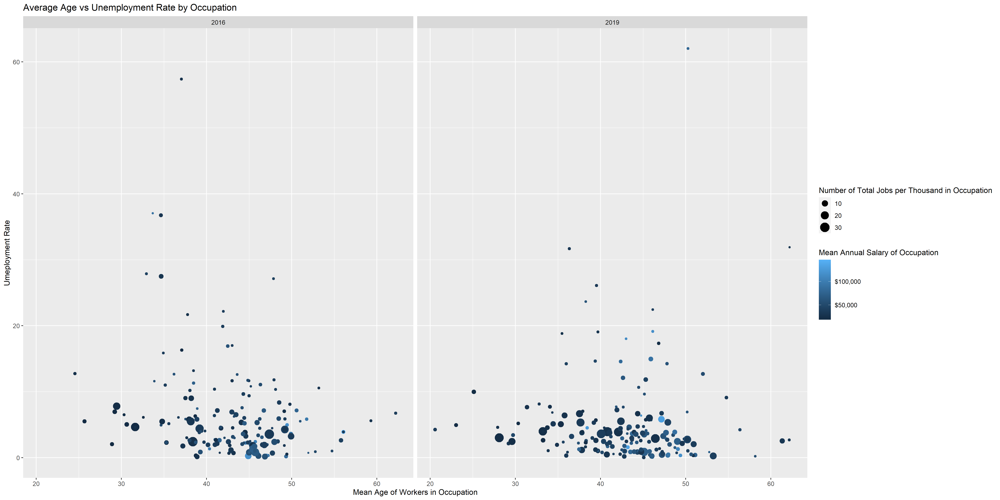

```{r setup, include=FALSE}
knitr::opts_chunk$set(echo = TRUE)
setwd("~/Fall 2021/Stat 433/Stat-433-Project")
```


For this analysis we are using age as a predictor of occupational shortages.

An occupational shortage is defined by three criteria:

1. The occupation’s employment growth rate is at least 50 percent faster than average employment growth

2. The wage increase is at least 30 percent faster than average.

3. The occupation’s unemployment rate is at least 30 percent below average.

We have constructed a scatter plot using ggplot2 that shows snap shots the above elements. 


